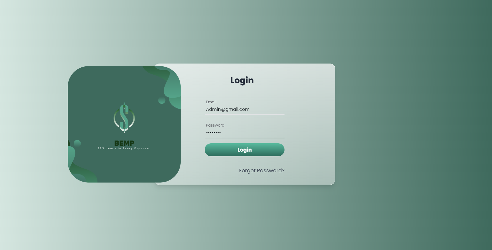

# BEMP Project

### Project Description

This **Department and Project Management System** streamlines budget tracking, project management, and resource allocation. Built with **Node.js (Express.js)** and **MSSQL** for the backend, and **React**, **NextUI**, **ECharts** and the styling was done by **Tailwind** for the frontend , it offers CRUD operations, real-time budget updates, and interactive dashboards. Ideal for optimizing financial and project workflows in organizations.

## Installation

## Backend

To set up and run the Node.js backend, follow these steps:

1.  ### **Install Node.js and npm:**
    Download and install Node.js from the [official website](https://nodejs.org/). This will also install npm, the Node Package Manager.

2.  ### **Navigate to the Backend Directory:**
    Open your terminal or command prompt and navigate to the directory where your backend code is located.

3.  ### **Install Backend Dependencies:**
    Run the following command to install the required npm packages (express, mssql, cors):
    ```bash
    npm install express mssql cors
    ```

4.  ### **Configure the Database:**

    Create a file named `.env` in your backend directory and add the following environment variables, updating them with your Microsoft SQL Server credentials:

    ```env
    DB_USER=your-username
    DB_PASSWORD=your-password
    DB_SERVER=localhost
    DB_DATABASE=your-database-name
    DB_INSTANCE=SQLEXPRESS
    DB_PORT=1433
    ```
    **Note:**  Ensure you have `dotenv` installed if you plan on using `.env` for your backend:
       ```bash
        npm install dotenv
        ```

    **Note:** Make sure to use `process.env` to get these environment variables in your backend files.

    **Example (in your backend code):**

    ```javascript
    require('dotenv').config();

    const config = {
    user: process.env.DB_USER,
    password: process.env.DB_PASSWORD,
    server: process.env.DB_SERVER,
    database: process.env.DB_DATABASE,
    options: {
        trustedConnection: false,
        trustServerCertificate: true,
        enableArithAbort: true,
        instancename: process.env.DB_INSTANCE,
    },
    port: parseInt(process.env.DB_PORT, 10),
    };

    ```

5.  ### **Run the Node.js Backend:**
    Start the backend server by executing your main JavaScript file. Assuming your main file is named `index.js` or `server.js`, the command would be:
    ```bash
    node index.js
    ```
    or
    ```bash
    node server.js
    ```

## Frontend

1.  ### **Install Node.js:**

    Download [Node.js](https://nodejs.org/)

2.  ### **Deleting the `node_modules` and `package-lock.json`, then reinstalling them**

    1.  Deleting the files for the dependencies to work on your laptop
        ```bash
        del package-lock.json && rmdir /s /q node_modules
        ```
    2.  Reinstall them to work on your laptop
        ```bash
        npm install
        ```

3.  ### **Run the React-app for the frontend:**
    ```bash
    npm run dev
    ```

## Demo

[Link For The Demo Video](https://drive.google.com/drive/folders/1s_T6uwSWIF5L4_SEDUsJj5-uWGauNrt7)

## Authors

-   [@YahiaSonbol](https://www.linkedin.com/in/yahia-sonbol/)


## Some Screenshots from the Website:

#### LoginPage:
"
#### Dashboard:

#### Departments:

#### Add Project Modal:

#### Edit Project Modal:

#### Delete Project Modal:

